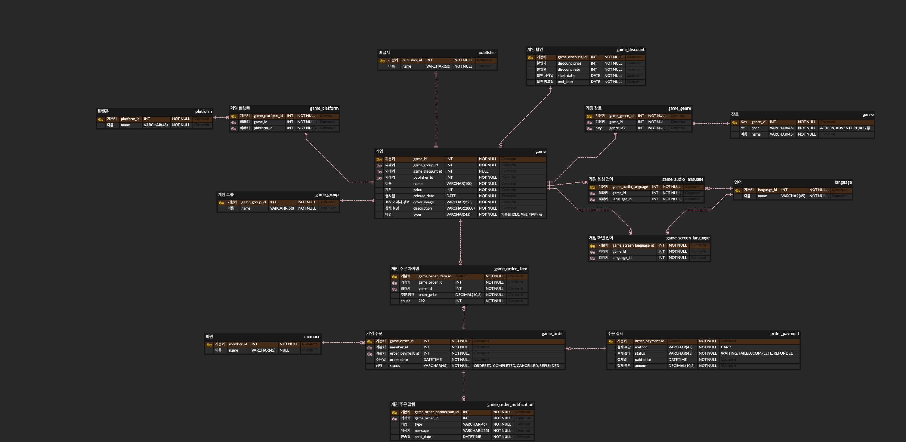
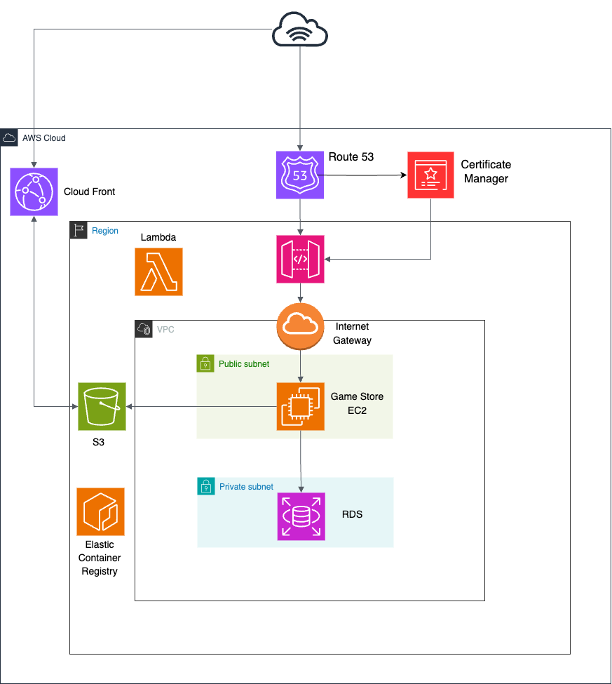

# Game-Store 프로젝트
- 플레이스테이션 스토어를 참고해서 만든 게임 사이트로 게임 관리 기능, 할인 게임 목록 조회 기능을 제공하고 있습니다.
- [참고한 PSN 스토어 프로모션 탭](https://store.playstation.com/ko-kr/pages/deals)

## AWS 운영 서버 및 스웨거
- [Game-Store 운영 서버](https://www.ktstore.click/)

## 목차
- [기술 스택](#기술-스택)
- [테이블 ERD](#테이블-ERD)
- [프로젝트 개선 사항 기록](#프로젝트-개선-사항-기록)

## 기술 스택

### 백엔드
- Java 17
- SpringBoot 3.4.1
- JPA (Spring Data JPA, QueryDSL)
- MySql 8.0.32

### 프론트엔드
- Thymeleaf

### 개발 도구
- IntelliJ IDEA

## 테이블 ERD



## 프로젝트 개선 사항 기록

### 1. 테스트
- 띠요요용!

### 2. 레디스 캐시 적용
_기존 문제점과 레디스 사용 장점_
- 게임 등록 화면을 진입시마다 @ModelAttribute 애노테이션을 통해 게임그룹, 배급사, 언어, 플랫폼, 장르 데이터 쿼리가 5번씩 매번 발생
- 레디스 서버에 해당 데이터를 캐시로 등록하고 조회하여 사용
- DB는 디스크 기반 I/O, Redis는 메모리 기반 I/O 속도 차이가 10배 정도 발생
- DB 커넥션 풀 기본 개수는 10개인데, 트랙피 많이 발생하는 시점에 변경 가능성이 없는 데이터를 자주 조회하면 DB 부하 발생 가능성이 높다
```java
//기존 방식
@Controller
GameController {
  ...
  @ModelAttribute("gameGroups")
  public List<GameGroupResponse> gameGroups() {...}
  @ModelAttribute("publishers")
  public List<PublisherResponse> publishers() {...}
  @ModelAttribute("languages")
  public List<LanguageResponse> languages() {...}
  @ModelAttribute("platforms")
  public List<PlatformResponse> platforms() {...}
  @ModelAttribute("genres")
  public List<GenreResponse> genres() {...}
}

//레디스 매니저 클래스 사용
@Controller
GameController {
  private final RedisCacheManager redisCacheManager;

  @ModelAttribute("gameGroups")
  public List<GameGroupResponse> gameGroups() {
      return redisCacheManager.getCacheGameGroups();
  }
}

@RequiredArgsConstructor
@Component
public class RedisCacheManager {
	public List<GenreResponse> getCacheGenres() {
		final String KEY = "list:genres";
		String jsonData = stringRedisTemplate.opsForValue().get(KEY);
		
		if (jsonData != null) {
			return deserializeJson(jsonData, new TypeReference<ArrayList<GenreResponse>>() {
			});
		}
		
		List<GenreResponse> genreResponses = genreRepository.findAll().stream()
				.map(GenreResponse::new)
				.sorted(Comparator.comparing(GenreResponse::getName))
				.toList();
		
		stringRedisTemplate.opsForValue().set(KEY, serializeJson(genreResponses), 24, TimeUnit.HOURS);
		
		return genreResponses;
    }

	private <T> String serializeJson(T data) {
        try {
            return objectMapper.writeValueAsString(data);
        } catch (JsonProcessingException e) {
            throw new RuntimeException(e);
        }
    }

	private <T> T deserializeJson(String json, TypeReference<T> typeReference) {
        try {
            return objectMapper.readValue(json, typeReference);
        } catch (JsonProcessingException e) {
            throw new RuntimeException(e);
        }
    }
}
```

### 3. HTTP 통신 타임아웃 설정
__타임아웃 옵션__
- HTTP 통신 시 연결 시간(connect timeout)이나 응답 대기 시간(read timeout)을 설정하지 않으면, 네트워크 지연이나 서버 응답이 없는 상황에서도 요청을 기다리게 된다<br>
- 결국 쓰레드 풀에 쓰레드가 반납되지 않게 되어 서버가 다운되는 상황이 발생하게 된다
```java
@Bean
public RestTemplate restTemplate() {
  SimpleClientHttpRequestFactory httpRequestFactory = new SimpleClientHttpRequestFactory();
  httpRequestFactory.setConnectTimeout(3000); //(연결시) 서버와 연결(Connection) 시도 최대 대기 시간
  httpRequestFactory.setReadTimeout(5000); //(응답시) socketTimeout, 서버 응답 대기 시간
}
```

### 4. 쿼리 실행 계획, 인덱스 설정
```sql
#할인 중인 게임 목록 조회 쿼리
SELECT g.*
FROM game g JOIN game_discount gd 
	ON g.game_discount_id = gd.game_discount_id
```
__인덱스 설정 관련 학습사항__
- game_discount_id 컬럼에 인덱스를 생성하기 전에는 game 테이블의 rows 수가 약 476건으로 표시되었으나, 인덱스 생성 후에는 약 268건으로 줄어들어 쿼리 성능이 향상됨
- 인덱스가 없을 경우 전체 테이블 스캔이 발생하는 반면, 인덱스가 존재하면 필요한 데이터만 빠르게 조회하기 때문이다
- 옵티마이저는 인덱스를 통해 더 효율적인 조인 순서를 선택한다
- 복합 인덱스는 왼쪽 순서부터 인덱스가 적용된다

#### 실행 계획 타입
|이름|용도|
|-----|-----|
|All|테이블 전체 스캔|
|Const|단일 테이블 조회, 1건 매칭, primary, unique key|
|Eq-ref|조인 조회, 1건 매칭, primary, unique key|
|Ref|일반 인덱스(중복 허용), game 테이블의 type 컬럼 인덱스처럼 중복 존재(PRODUCT, DLC, ITEM, COSTUME, CHARATOR)|
|Range|인덱스에 범위 검색(ex:Between)|
|Index|인덱스를 전체 스캔|

#### 외래키 관련 학습
- 외래키 설정시 참조 무결성(외래키 값은 반드시 해당 테이블에 존재해야함) 제약 조건 때문에 데이터 삽입/수정 실패하는 상황이 발생한다
- 레코드 삭제/수정시 순서에 제약이 생긴다
- 급하게 수정사항 발생시 참조 대상이 없으면 데이터 삽입 실패 발생할 수 있다

### 5. 스프링 AOP 관련 학습

#### 프로젝트 적용 코드
__APO 적용 기능__
- 쿼리 실행 시간이 1초가 초과하면 해당되는 메서드와 파라미터 조건 로그 기록
- HTTP 통신 오류 발생시 재시도 한 번 더 실행
```java
@Slf4j
@Component
@Aspect
public class MyAspect {

  @Around("execution(* com.mrlee.game_store.service.GameService.*(..))")
  public Object monitorExecutionTime(ProceedingJoinPoint joinPoint) throws Throwable {

    log.info("Execution method: {}", joinPoint.getSignature().getName());

    Object[] args = joinPoint.getArgs();
    for (int i = 0; i < args.length; i++) {
      log.info("Execution Parameter [{}]: {}", i + 1, args[i]);
    }

    long startTime = System.currentTimeMillis();

    Object result = joinPoint.proceed();

    long endTime = System.currentTimeMillis();
    long executionTime = endTime - startTime;

    if (executionTime > 1000) {
      log.warn("[PERFORMANCE WARNING] Execution time = {}ms", executionTime);
    }

    return result;
  }

  @Around("@annotation(httpRetry)")
  public Object handleHttpRetry(ProceedingJoinPoint joinPoint, HttpRetry httpRetry) throws Throwable {

    int maxRetryCount = httpRetry.value();
    Exception exception = null;

    log.info("handleHttpRetry: {}", joinPoint.getSignature().getName());

    for (int i = 0; i <= maxRetryCount; i++) {
      try {
	log.info("handleHttpRetry Count={}/{}", i, maxRetryCount);
	return joinPoint.proceed();
      } catch (Exception e) {
	log.info("HTTP 통신 오류:: {}", e.getMessage());
	exception = e;
	if (i == (maxRetryCount - 1)) {
	    Thread.sleep(1000);
	}
      }
    }

    throw exception != null ? exception : new RuntimeException("http 재시도 호출 로직에서 오류 발생.");
  }
}

@Target(ElementType.METHOD)
@Retention(RetentionPolicy.RUNTIME)
public @interface HttpRetry { //재시도 애노테이션 선언
  int value() default 1;
}

@Slf4j
@RequiredArgsConstructor
@Component
public class RestTemplateUtil {

  @HttpRetry //재시도 애노테이션
  public void post(String url, Object request) {
    HttpEntity<Object> httpEntity = createHttpEntity(request);
    callIamPort(httpEntity);
  }
}
```
### 6. AWS 환경 개선
- 기존 프로젝트 구조와 배포 방식
	- 게임 이미지를 프로젝트 내에 resources/static/image 폴더에 직접 저장해서 사용
	- 인텔리제이 빌드를 통해 .jar 파일 생성
 	- ssh로 원격 ec2 서버를 접속하고 scp 명령어를 통해서 .jar 파일을 전송
  	- ec2 서버의 .jar 파일을 실행
- 개선 사항
	- AWS의 S3 버킷에 게임 이미지를 저장하고 CloudFront를 사용해서 이미지를 캐시화해서 조회하는 방식으로 변경
 	- 프로젝트 파일을 .jar로 빌드하고 Docker 이미지로 만든 후 AWS ElasticContainerRegistry에 도커 이미지를 업로드
    - EC2 인스턴스 생성시에 IAM 역할을 통해 ECR에 업로드된 도커 파일을 받아서 도커로 실행
    - AWS Certificate Manager에서 인증서 발급 -> 기존 http에서 https로 변경
#### AWS ERD

